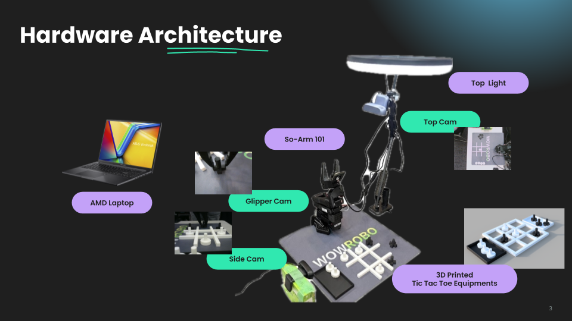
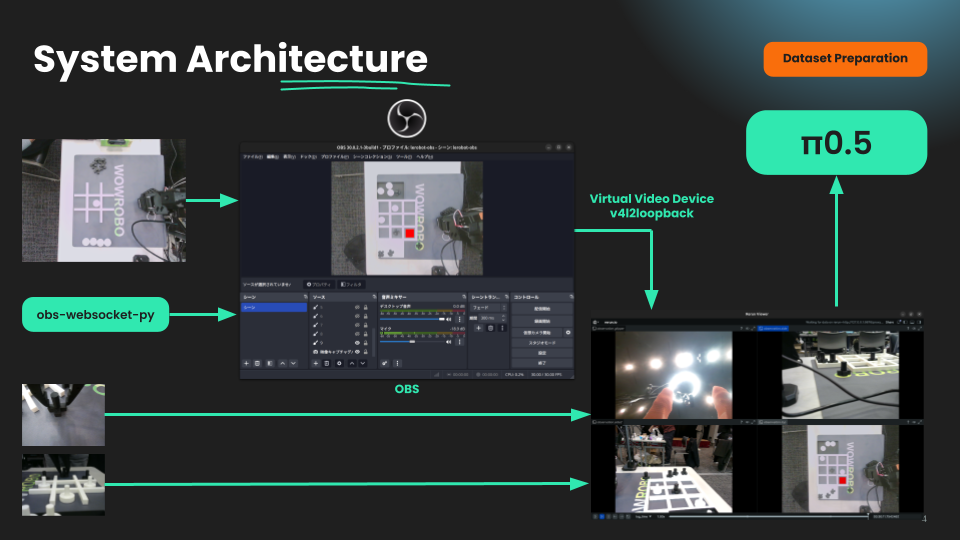
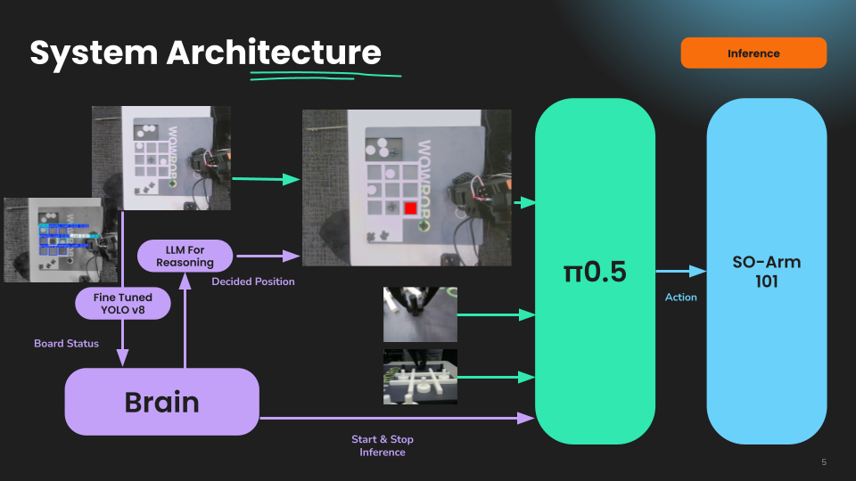

# AMD_Robotics_Hackathon_2025_Kaina-TTT

## Team Information
**Team:** Kaina

**Members** [Ryo Igarashi](https://github.com/igaryo0506), [Kenta Mori](https://github.com/zoncoen), [Shota Iwami](https://github.com/BIwashi), [Gen Shu](https://github.com/genkey6)

**Summary**
A robotic arm that plays Tic-Tac-Toe. It uses a camera to see the board, a YOLOv8 model to identify pieces, a local LLM to decide the next move, and a custom pipeline to control the arm and overlay the action. This project also establishes an integrated pipeline to execute an entire match sequence.





**Code Components**
- `mission2/code/tic_tac_toe_overlay`: Fine-tuned YOLOv8n to classify each cell as empty/O/X.
- `mission2/code/tic-tac-toe-planner`: Text-only planner using a local LLM to choose the next move.
- `mission2/code/ttt-pipeline`: A pipeline that connects the components, captures frames, detects the board, calls the planner, and streams the video.

**How To**: reproduce end-to-end
1. Set up dependencies (Python 3.10+). Using `uv`:
   ```bash
   cd mission2/code/tic_tac_toe_overlay   && uv sync
   cd ../tic-tac-toe-planner              && uv sync
   cd ../ttt-pipeline                     && uv sync
   ```
   Ensure `ffmpeg` and a v4l2loopback/virtual camera device (e.g., `/dev/video12`) exist for streaming. Download the planner model locally (default `Qwen/Qwen3-4B-Instruct-2507`) so transformers can load it offline.
2. Train or reuse the YOLO cell detector. The overlay script auto-generates a synthetic dataset and trains if weights are missing:
   ```bash
   cd mission2/code/tic_tac_toe_overlay
   uv run python3 main.py \
     --image top-camera.jpg \
     --output overlay.jpg \
     --state-json board_state.json \
     --print-state \
     --device cpu          # use cuda:0 or mps if available
   ```
   Add `--real-data real` to mix labeled real images, `--force-train`/`--force-regen` to retrain/regenerate synth data. Weights are saved to `models/cell_grid.pt`.
3. Plan a move from the detected board (text-only LLM):
   ```bash
   cd mission2/code/tic-tac-toe-planner
   uv run tic_tac_toe_planner.py \
     --state-json ../tic_tac_toe_overlay/board_state.json \
     --model Qwen/Qwen3-4B-Instruct-2507
   ```
   Optional: `--obs-host localhost` to toggle OBS sources `1`–`9` in scene `シーン`.
4. Run the live pipeline to overlay the next action on the camera feed and stream to the virtual device:
   ```bash
   cd mission2/code/ttt-pipeline
   uv run python3 main.py \
     --source 0 \
     --weights ../tic_tac_toe_overlay/models/cell_grid.pt \
     --planner-model Qwen/Qwen3-4B-Instruct-2507 \
     --interval 5 \
     --display \
     --save-state latest_board.json
   ```
   The script polls the board every `--interval` seconds, calls the planner when the state changes, masks the chosen cell in red, and pipes frames to `/dev/video12` via `ffmpeg` (edit the hard-coded device in `main.py` if needed). Use `--display` to preview locally; press `q` to quit.

5. Copy Makefile to exector home. and run π0.5 inference
    ```
    make inference-pi
    ```

## Submission Details

### 1. Mission Description
- Introducing a new form of interactive entertainment — playing board games against a robot opponent.
- While the current mission centers on Tic-Tac-Toe, the modular perception–reasoning–motion architecture allows seamless adaptation to other games or interactive scenarios, demonstrating the versatility of the system.

### 2. Creativity
- Robust perception: YOLOv8 detects the 3x3 grid and cell states (X/O/empty) from mostly synthetic data with a few real labels, so camera angle or board design changes can be adapted quickly.
- Strategy via text-only LLM: the board is serialized to text and a small local LLM plans the next move; difficulty/style can be prompted without any vision-language model.
- Simple control handoff: the pipeline overlays the chosen cell as a red mask on the live feed; the arm only needs to follow that mask to place a piece, even if the board position shifts.
- Generalizable architecture: the same grid-detect → text-plan → overlay pattern can be retargeted to other small-board games by swapping the synthetic template and prompt.

### 3. Technical implementations
- *Teleoperation / Dataset capture*
    - Robotics ML Model's Task is "Pick up 3d printed figure and put on the target place".
    - Areas of Focus for Data Collection
        - Only see laptop rerun view (camera view) in order to get efficient information for robots.
        - Pick up and place Figure Carefully.
        - To avoid mixing learning data and reducing accuracy, move directly and accurately to the target area.
        - Add Target Bounding Box for Inference using OBS tool.
            <video controls width="360px">
                <source src="./media/TeleOperation/Teleop.mp4" type="video/mp4">
                Your browser does not support the video tag.
            </video>
            
            
            
- *Training*
    - The powerful MI300X accelerator enabled fast training with larger batch sizes, significantly speeding up the model's learning process. 
- *Inference*
    - **Inference with Pi0.5 Model using Real Time Chunking (RTC)**
        - The Pi0.5 model, a lightweight policy network, utilizes Real Time Chunking (RTC) to predict and execute entire action sequences in a single inference step. This method, evolved from Action Chunking Transformers, processes movements as complete "chunks" (e.g., "grasp → lift → move → place") rather than frame-by-frame. This approach is particularly effective on AMD's high-performance hardware, where the parallel processing capabilities can be fully leveraged to minimize latency and ensure smooth, real-time robotic manipulation.
    - **Board State Detection using Fine-tuned YOLO**
        - A fine-tuned YOLOv8n model detects the contents and bounding box of each cell (empty, X, or O), forming the initial step of the inference pipeline. This output is then bifurcated: the natural language description of the board state is fed to the LLM for strategic planning, while the bounding box coordinates are used by the Pi0.5 model to guide the robot's physical movements.
    - **Reasoning with LLM**
        - Leveraging the powerful reasoning capabilities of a text-only Large Language Model (LLM), the system acts as a board game solver. It processes the YOLO-detected board state as text to determine and return the optimal next move.

### 4. Ease of use
The strength of this project lies in its highly modular and generalizable architecture. By separating motion planning from reasoning, the system offers significant flexibility and adaptability.

- **General-Purpose Design**: Unlike monolithic models (e.g., VLA), this architecture delegates tasks to specialized components. This separation allows the reasoning model to be used for a wide variety of tasks beyond board games, simply by training new motion policies. The core logic remains independent of the specific physical action.
    - **Innovative Learning Approach**: The project utilizes a groundbreaking learning methodology for Transformers and Vision-Language-Action (VLA) models, which significantly enhances generalizability and facilitates broader application across various motion tasks. This approach emphasizes separating the reasoning component from motion execution, allowing for greater flexibility and easier adaptation to new scenarios.
- **Modular Components**:
    - **Perception (YOLOv8)**: Handles the visual understanding of the environment. This module can be retrained or replaced to recognize different objects or scenes.
    - **Reasoning (LLM)**: A text-only Large Language Model that determines the strategic next step. It is completely decoupled from the robot's physical capabilities.
    - **Motion (ACT/Pi0.5)**: The policy models that execute the physical movements. New motions can be taught and integrated without altering the reasoning or perception modules.
- **Simple Control Interface**: The entire pipeline is orchestrated through a series of straightforward command-line scripts. Users can initiate detection, planning, and the full pipeline with clear and configurable commands, allowing for easy experimentation and integration.

## Additional Links
*For example, you can provide links to:*

- *Link to a video of your robot performing the task*
- *URL of your dataset in Hugging Face*
    - https://huggingface.co/datasets/guren-kaina/tic-tac-toe-1
    - https://huggingface.co/datasets/guren-kaina/tic-tac-toe-2
    - https://huggingface.co/datasets/guren-kaina/tic-tac-toe-3
    - https://huggingface.co/datasets/guren-kaina/tic-tac-toe-4
    - https://huggingface.co/guren-kaina/tic-tac-toe-cell-detector
- *URL of your model in Hugging Face*
    - https://huggingface.co/guren-kaina/tic-tac-toe-1
    - https://huggingface.co/guren-kaina/act-tic-tac-toe-2
    - https://huggingface.co/guren-kaina/pi05_tic-tac-toe-2
    - https://huggingface.co/guren-kaina/act-tic-tac-toe-3
    - https://huggingface.co/guren-kaina/pi05_tic-tac-toe-3
    - https://huggingface.co/guren-kaina/act-tic-tac-toe-4
    - https://huggingface.co/guren-kaina/pi05_tic-tac-toe-4
    - https://huggingface.co/datasets/guren-kaina/tic-tac-toe-board-dataset
- *Link to a blog post describing your work*
    - soon

## Code submission

This is the directory tree of this repo, you need to fill in the `mission` directory with your submission details.

```terminal
AMD_Robotics_Hackathon_2025_ProjectTemplate-main/
├── README.md
└── mission
    ├── code
    │   └── <code and script>
    └── wandb
        └── <latest run directory copied from wandb of your training job>
```


The `latest-run` is generated by wandb for your training job. Please copy it into the wandb sub directory of you Hackathon Repo.

The whole dir of `latest-run` will look like below:

```terminal
$ tree outputs/train/smolvla_so101_2cube_30k_steps/wandb/
outputs/train/smolvla_so101_2cube_30k_steps/wandb/
├── debug-internal.log -> run-20251029_063411-tz1cpo59/logs/debug-internal.log
├── debug.log -> run-20251029_063411-tz1cpo59/logs/debug.log
├── latest-run -> run-20251029_063411-tz1cpo59
└── run-20251029_063411-tz1cpo59
    ├── files
    │   ├── config.yaml
    │   ├── output.log
    │   ├── requirements.txt
    │   ├── wandb-metadata.json
    │   └── wandb-summary.json
    ├── logs
    │   ├── debug-core.log -> /dataset/.cache/wandb/logs/core-debug-20251029_063411.log
    │   ├── debug-internal.log
    │   └── debug.log
    ├── run-tz1cpo59.wandb
    └── tmp
        └── code
```

**NOTES**

1. The `latest-run` is the soft link, please make sure to copy the real target directory it linked with all sub dirs and files.
2. Only provide (upload) the wandb of your last success pre-trained model for the Mission.
